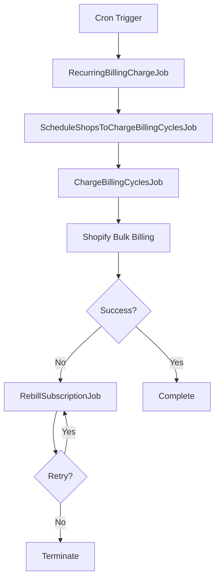

## Overview

Billing jobs handle the automated processing of subscription billing cycles. The system schedules shops for billing, processes billing cycles in bulk, and handles rebilling for failed attempts.

All billing jobs use the `billing` queue (except `RecurringBillingChargeJob` which uses the default queue and `RebillSubscriptionJob` which uses the `rebilling` queue).

## RecurringBillingChargeJob

Initiates the billing process by scheduling shops to have their billing cycles charged.

### Usage

```typescript
import {jobs} from '~/jobs';
import {RecurringBillingChargeJob} from '~/jobs/billing';

const job = new RecurringBillingChargeJob({});
await jobs.enqueue(job);
```

### Implementation Details

- Calculates target date as the current hour in UTC
- Enqueues a `ScheduleShopsToChargeBillingCyclesJob` for the target date
- Typically triggered by a cron job or scheduler

See app/jobs/billing/RecurringBillingChargeJob.ts:8 for the implementation.

## ScheduleShopsToChargeBillingCyclesJob

Processes active billing schedules and creates billing jobs for shops that are due to be billed.

### Parameters

```typescript
type Parameters = {
  targetDate: string; // ISO 8601 date string
};
```

### Usage

```typescript
import {DateTime} from 'luxon';
import {jobs} from '~/jobs';
import {ScheduleShopsToChargeBillingCyclesJob} from '~/jobs/billing';

const targetDate = DateTime.utc().startOf('hour').toISO();

const job = new ScheduleShopsToChargeBillingCyclesJob({targetDate});
await jobs.enqueue(job);
```

### How It Works

<Steps>

### Fetch Active Billing Schedules

Retrieves all active billing schedules from the database in batches.

### Calculate Billable Shops

For each billing schedule, uses `BillingScheduleCalculatorService` to determine if the shop should be billed at the target date.

### Enqueue Billing Jobs

Creates a `ChargeBillingCyclesJob` for each billable shop with the calculated start and end dates.

</Steps>

See app/jobs/billing/ScheduleShopsToChargeBillingCyclesJob.ts:11 for the implementation.

## ChargeBillingCyclesJob

Charges subscription billing cycles for a specific shop using Shopify's bulk billing API.

### Parameters

```typescript
type Parameters = {
  shop: string;
  payload: {
    startDate: string; // ISO 8601 date string
    endDate: string;   // ISO 8601 date string
  };
};
```

### Usage

```typescript
import {jobs} from '~/jobs';
import {ChargeBillingCyclesJob} from '~/jobs/billing';

const job = new ChargeBillingCyclesJob({
  shop: 'example.myshopify.com',
  payload: {
    startDate: '2024-04-01T00:00:00.000Z',
    endDate: '2024-04-01T23:59:59.999Z',
  },
});

await jobs.enqueue(job);
```

### GraphQL Operation

Executes the `subscriptionBillingCycleBulkCharge` mutation with filters:

- Contract status: `ACTIVE`
- Billing cycle status: `UNBILLED`
- Billing attempt status: `NO_ATTEMPT`
- Date range: between `startDate` and `endDate`

### Error Handling

- Validates the GraphQL response structure
- Logs the created bulk charge job ID
- Throws an error if the mutation fails or returns user errors

See app/jobs/billing/ChargeBillingCyclesJob.ts:12 for the implementation.

## RebillSubscriptionJob

Retries billing for a specific subscription contract that previously failed.

### Parameters

```typescript
type Parameters = {
  shop: string;
  payload: {
    subscriptionContractId: string; // GraphQL ID
    originTime: string;             // ISO 8601 date string
  };
};
```

### Usage

```typescript
import {jobs} from '~/jobs';
import {RebillSubscriptionJob} from '~/jobs/billing';

const job = new RebillSubscriptionJob({
  shop: 'example.myshopify.com',
  payload: {
    subscriptionContractId: 'gid://shopify/SubscriptionContract/123',
    originTime: '2024-04-01T10:00:00.000Z',
  },
});

await jobs.enqueue(job);
```

### How It Works

<Steps>

### Check Payment Status

Fetches the subscription contract details and checks if the last payment succeeded. If successful, terminates early.

### Execute Rebilling

Calls the `subscriptionBillingCycleCharge` mutation for the specific contract and origin time.

### Handle User Errors

Checks for persistent errors that shouldn't be retried:
- `CONTRACT_PAUSED`
- `BILLING_CYCLE_SKIPPED`
- `CONTRACT_TERMINATED`
- `BILLING_CYCLE_CHARGE_BEFORE_EXPECTED_DATE`

These errors terminate the job without retrying.

</Steps>

See app/jobs/billing/RebillSubscriptionJob.ts:8 for the implementation.

## Billing Flow

The complete billing flow follows this sequence:



## Queue Configuration

Billing jobs use custom queues:

- `RecurringBillingChargeJob`: `default` queue
- `ScheduleShopsToChargeBillingCyclesJob`: `billing` queue
- `ChargeBillingCyclesJob`: `billing` queue
- `RebillSubscriptionJob`: `rebilling` queue

This separation allows independent rate limiting and retry policies for different billing operations.

## Related

- [Job System Overview](/api/jobs/overview)
- [Dunning Jobs](/api/jobs/dunning-jobs)