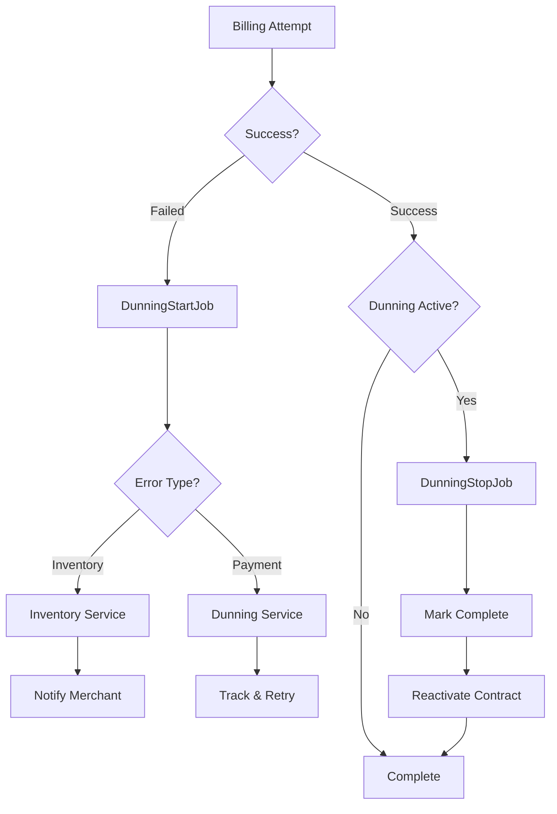

## Overview

Dunning jobs handle the automated recovery process when subscription billing attempts fail. The system tracks failed payments, manages dunning states, and automatically resumes contracts when payments succeed.

Both dunning jobs use the `webhooks` queue and are typically triggered by Shopify webhook events.

## DunningStartJob

Initiates the dunning process when a subscription billing attempt fails.

### Parameters

```typescript
type Parameters = {
  shop: string;
  payload: {
    admin_graphql_api_id: string;  // Billing attempt ID
    error_code: string;            // Failure reason code
  };
};
```

### Usage

```typescript
import {jobs} from '~/jobs';
import {DunningStartJob} from '~/jobs/dunning';

const job = new DunningStartJob({
  shop: 'example.myshopify.com',
  payload: {
    admin_graphql_api_id: 'gid://shopify/SubscriptionBillingAttempt/123',
    error_code: 'PAYMENT_METHOD_DECLINED',
  },
});

await jobs.enqueue(job);
```

### Error Code Handling

The job handles different failure reasons with specific strategies:

#### Inventory Errors

For inventory-related failures, the job uses the inventory service:

- `INSUFFICIENT_INVENTORY`
- `INVENTORY_ALLOCATIONS_NOT_FOUND`

```typescript
const inventoryService = await buildInventoryService({
  shopDomain: shop,
  billingAttemptId,
  failureReason,
});

const result = await inventoryService.run();
```

#### Payment Errors

For all other failure reasons, the job uses the dunning service:

```typescript
const dunningService = await buildDunningService({
  shopDomain: shop,
  billingAttemptId,
  failureReason,
});

const result = await dunningService.run();
```

### How It Works

<Steps>

### Receive Webhook Event

Triggered by the `subscription_billing_attempts/failure` webhook from Shopify.

### Determine Error Type

Checks if the error is inventory-related or payment-related.

### Execute Recovery Strategy

- **Inventory errors**: Notifies merchant about inventory issues
- **Payment errors**: Starts dunning process with retry attempts

### Track Dunning State

Creates or updates a `DunningTracker` record to monitor the recovery process.

</Steps>

See app/jobs/dunning/DunningStartJob.ts:12 for the implementation.

## DunningStopJob

Stops the dunning process and reactivates the subscription contract when a billing attempt succeeds.

### Parameters

```typescript
type Parameters = {
  shop: string;
  payload: {
    admin_graphql_api_id: string;                   // Billing attempt ID
    admin_graphql_api_subscription_contract_id: string; // Contract ID
  };
};
```

### Usage

```typescript
import {jobs} from '~/jobs';
import {DunningStopJob} from '~/jobs/dunning';

const job = new DunningStopJob({
  shop: 'example.myshopify.com',
  payload: {
    admin_graphql_api_id: 'gid://shopify/SubscriptionBillingAttempt/123',
    admin_graphql_api_subscription_contract_id: 'gid://shopify/SubscriptionContract/456',
  },
});

await jobs.enqueue(job);
```

### How It Works

<Steps>

### Find Dunning Tracker

Looks up the dunning tracker record for the subscription contract and billing cycle:

```typescript
const dunningTracker = await getDunningTracker(
  shop,
  billingAttemptId,
  contractId,
);
```

If no dunning tracker is found, the job terminates early (no dunning process was active).

### Mark Dunning Complete

Updates the dunning tracker status to completed:

```typescript
await markCompleted(dunningTracker);
```

### Reactivate Contract

If the contract was paused due to payment failures, reactivates it:

```typescript
const response = await admin.graphql(SubscriptionContractResume, {
  variables: {
    subscriptionContractId: contractId,
  },
});
```

</Steps>

### Error Handling

- Logs a warning if the contract reactivation fails
- Throws an error if user errors are returned from the GraphQL mutation
- Terminates early if no dunning tracker exists

See app/jobs/dunning/DunningStopJob.ts:10 for the implementation.

## Dunning Flow

The complete dunning flow follows this sequence:



## Dunning Tracker Schema

The dunning system tracks payment failures in the database:

```prisma
model DunningTracker {
  id                Int      @id @default(autoincrement())
  shop              String
  contractId        String
  billingCycleIndex Int
  status            String   // e.g., 'active', 'completed'
  createdAt         DateTime @default(now())
  updatedAt         DateTime @updatedAt
}
```

## Integration with Webhooks

Dunning jobs are triggered by Shopify webhook events:

### subscription_billing_attempts/failure

Triggers `DunningStartJob` with the failed billing attempt details:

```typescript
// Webhook handler
export async function action({request}: ActionFunctionArgs) {
  const payload = await request.json();
  const shop = request.headers.get('x-shopify-shop-domain');

  const job = new DunningStartJob({
    shop: shop!,
    payload,
  });

  await jobs.enqueue(job);
}
```

### subscription_billing_attempts/success

Triggers `DunningStopJob` to complete the dunning process:

```typescript
// Webhook handler
export async function action({request}: ActionFunctionArgs) {
  const payload = await request.json();
  const shop = request.headers.get('x-shopify-shop-domain');

  const job = new DunningStopJob({
    shop: shop!,
    payload,
  });

  await jobs.enqueue(job);
}
```

## Queue Configuration

Both dunning jobs use the `webhooks` queue:

- `DunningStartJob`: `webhooks` queue
- `DunningStopJob`: `webhooks` queue

This ensures webhook-triggered jobs are processed with appropriate priority and retry policies.

## Related Services

### DunningService

Manages payment retry logic and customer communication:

```typescript
const dunningService = await buildDunningService({
  shopDomain: shop,
  billingAttemptId,
  failureReason,
});

const result = await dunningService.run();
```

### InventoryService

Handles inventory-related billing failures:

```typescript
const inventoryService = await buildInventoryService({
  shopDomain: shop,
  billingAttemptId,
  failureReason,
});

const result = await inventoryService.run();
```

## Related

- [Job System Overview](/api/jobs/overview)
- [Billing Jobs](/api/jobs/billing-jobs)
- [Email Jobs](/api/jobs/email-jobs)