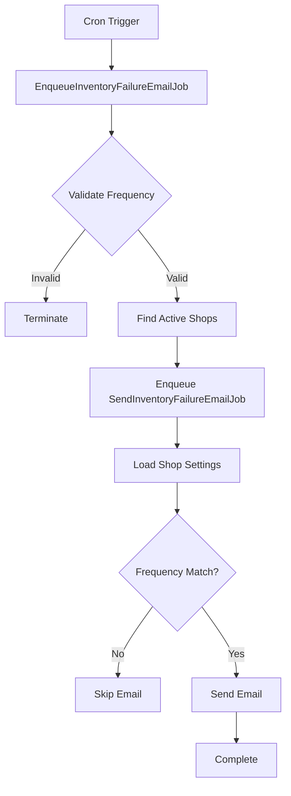

## Overview

Email jobs handle automated email notifications for subscription events. The system sends emails to customers about their subscriptions and to merchants about operational issues.

Most email jobs use the `webhooks` queue, except `SendInventoryFailureEmailJob` which uses the `default` queue.

## CustomerSendEmailJob

Sends email notifications to customers about their subscription events.

### Parameters

```typescript
type Parameters = {
  shop: string;
  payload: {
    admin_graphql_api_id: string;          // Subscription contract ID
    emailTemplate: string;                  // Template name
    admin_graphql_api_customer_id?: string; // Customer ID (optional)
    cycle_index?: number;                   // Billing cycle index (optional)
  };
};
```

### Usage

```typescript
import {jobs} from '~/jobs';
import {CustomerSendEmailJob} from '~/jobs/email';

const job = new CustomerSendEmailJob({
  shop: 'example.myshopify.com',
  payload: {
    admin_graphql_api_id: 'gid://shopify/SubscriptionContract/123',
    emailTemplate: 'subscription_created',
    admin_graphql_api_customer_id: 'gid://shopify/Customer/456',
  },
});

await jobs.enqueue(job);
```

### How It Works

<Steps>

### Resolve Customer ID

If the customer ID is not provided in the payload, fetches it from the subscription contract:

```typescript
if (!customerId) {
  customerId = await getContractCustomerId(shop, subscriptionContractId);
}
```

### Build Template Input

Constructs the email template input with contract details:

```typescript
const templateInput: CustomerEmailTemplateInput = {
  subscriptionContractId,
  subscriptionTemplateName,
};

if (billingCycleIndex) {
  templateInput.billingCycleIndex = billingCycleIndex;
}
```

### Send Email

Uses the `CustomerSendEmailService` to send the notification:

```typescript
await new CustomerSendEmailService().run(
  shop,
  customerId,
  templateInput,
);
```

</Steps>

See app/jobs/email/CustomerSendEmailJob.ts:8 for the implementation.

## MerchantSendEmailJob

Sends email notifications to merchants about subscription events.

### Parameters

```typescript
type Parameters = {
  shop: string;
  payload: {
    admin_graphql_api_id: string; // Subscription contract ID
  };
};
```

### Usage

```typescript
import {jobs} from '~/jobs';
import {MerchantSendEmailJob} from '~/jobs/email';

const job = new MerchantSendEmailJob({
  shop: 'example.myshopify.com',
  payload: {
    admin_graphql_api_id: 'gid://shopify/SubscriptionContract/123',
  },
});

await jobs.enqueue(job);
```

### Email Template

Currently sends the `SubscriptionCancelledMerchant` template:

```typescript
const merchantTemplateInput = {
  subscriptionContractId,
  subscriptionTemplateName:
    MerchantEmailTemplateName.SubscriptionCancelledMerchant,
};

await new MerchantSendEmailService().run(shop, merchantTemplateInput);
```

See app/jobs/email/MerchantSendEmailJob.ts:8 for the implementation.

## EnqueueInventoryFailureEmailJob

Schedules inventory failure email notifications for all active shops.

### Parameters

```typescript
type Parameters = {
  frequency: 'DAILY' | 'WEEKLY'; // Notification frequency
};
```

### Usage

```typescript
import {jobs} from '~/jobs';
import {EnqueueInventoryFailureEmailJob} from '~/jobs/email';

const job = new EnqueueInventoryFailureEmailJob({
  frequency: 'DAILY',
});

await jobs.enqueue(job);
```

### How It Works

<Steps>

### Validate Frequency

Checks if the frequency is valid:

```typescript
if (!IsValidInventoryNotificationFrequency(this.parameters.frequency)) {
  this.logger.error({frequency}, 'Invalid frequency');
  return;
}
```

### Process Active Billing Schedules

Iterates through all active shops in batches:

```typescript
await findActiveBillingSchedulesInBatches(async (batch) => {
  // Process each shop
});
```

### Enqueue Individual Jobs

Creates a `SendInventoryFailureEmailJob` for each shop:

```typescript
const job = new SendInventoryFailureEmailJob({
  shop: billingSchedule.shop,
  payload: {
    frequency: this.parameters.frequency,
  },
});

await jobs.enqueue(job);
```

### Track Results

Logs the number of successfully enqueued jobs:

```typescript
const startedJobsCount = results.filter(
  (result) => isFulfilled(result) && result.value,
).length;

this.logger.info({successCount: startedJobsCount}, 'Successfully enqueued jobs');
```

</Steps>

See app/jobs/email/EnqueueInventoryFailureEmailJob.ts:9 for the implementation.

## SendInventoryFailureEmailJob

Sends inventory failure notifications to merchants based on shop settings.

### Parameters

```typescript
type Parameters = {
  shop: string;
  payload: {
    frequency: 'DAILY' | 'WEEKLY';
  };
};
```

### Usage

```typescript
import {jobs} from '~/jobs';
import {SendInventoryFailureEmailJob} from '~/jobs/email';

const job = new SendInventoryFailureEmailJob({
  shop: 'example.myshopify.com',
  payload: {
    frequency: 'DAILY',
  },
});

await jobs.enqueue(job);
```

### How It Works

<Steps>

### Load Shop Settings

Fetches the shop's notification preferences from metaobjects:

```typescript
const {admin} = await unauthenticated.admin(shop);
const settings = await loadSettingsMetaobject(admin.graphql);

if (!settings) {
  this.logger.error({shopDomain: shop}, 'Failed to load settings');
  return;
}
```

### Check Notification Frequency

Compares the job frequency with the shop's configured frequency:

```typescript
if (isEmailable(frequency, settings.inventoryNotificationFrequency)) {
  // Send email
} else {
  this.logger.info('Skipping email - frequency mismatch');
}
```

### Send Email

Uses the merchant inventory email service:

```typescript
await new MerchantSendSubscriptionInventoryEmailService().run(shop);
```

</Steps>

See app/jobs/email/SendInventoryFailureEmailJob.ts:15 for the implementation.

## Email Flow

The inventory email notification flow:



## Email Template Types

### Customer Email Templates

Used by `CustomerSendEmailJob`:

- `subscription_created` - New subscription confirmation
- `subscription_cancelled` - Cancellation notification
- `subscription_paused` - Pause notification
- `subscription_resumed` - Resume notification
- `billing_attempt_failure` - Payment failure notification

### Merchant Email Templates

Used by `MerchantSendEmailJob`:

- `SubscriptionCancelledMerchant` - Customer cancelled subscription

### Inventory Email Templates

Used by `SendInventoryFailureEmailJob`:

- Inventory failure summary with affected subscriptions

## Queue Configuration

Email jobs use different queues based on their trigger:

- `CustomerSendEmailJob`: `webhooks` queue (webhook-triggered)
- `MerchantSendEmailJob`: `webhooks` queue (webhook-triggered)
- `EnqueueInventoryFailureEmailJob`: Not explicitly configured (uses default)
- `SendInventoryFailureEmailJob`: `default` queue (scheduled job)

## Notification Frequency Settings

Inventory notification frequency is configured per shop in the settings metaobject:

```typescript
type InventoryNotificationFrequency = 'DAILY' | 'WEEKLY' | 'NEVER';
```

The frequency determines how often merchants receive inventory failure summaries.

## Related

- [Job System Overview](/api/jobs/overview)
- [Dunning Jobs](/api/jobs/dunning-jobs)
- [Billing Jobs](/api/jobs/billing-jobs)