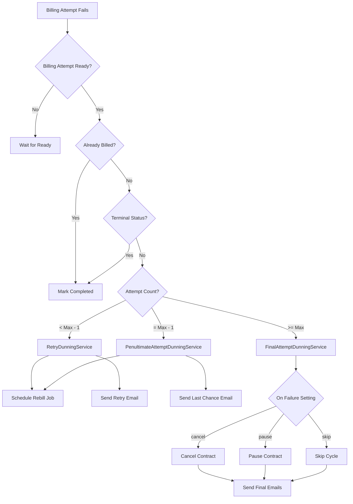

## What is Dunning?

Dunning is the process of handling failed subscription payments through:

1. **Automated retries**: Attempting to charge the customer again after a delay
2. **Customer communication**: Notifying customers about payment issues
3. **Final actions**: Taking action (pause, cancel, or skip) after all retries fail

<Note>
  The term "dunning" comes from the practice of repeatedly asking customers to pay outstanding debts.
</Note>

## Dunning Service Architecture

The app uses a multi-service architecture for dunning:

```typescript
// Main orchestrator
class DunningService {
  async run(): Promise<DunningServiceResult>
}

// Handles early retry attempts
class RetryDunningService {
  async run(): Promise<void>
}

// Handles second-to-last attempt
class PenultimateAttemptDunningService {
  async run(): Promise<void>
}

// Handles final attempt and takes action
class FinalAttemptDunningService {
  async run(): Promise<void>
}
```

## Dunning Flow



## DunningService Main Logic

### Service Result Types

```typescript
type DunningServiceResult =
  | 'BILLING_ATTEMPT_NOT_READY'
  | 'BILLING_CYCLE_ALREADY_BILLED'
  | 'CONTRACT_IN_TERMINAL_STATUS'
  | 'FINAL_ATTEMPT_DUNNING'
  | 'PENULTIMATE_ATTEMPT_DUNNING'
  | 'RETRY_DUNNING';
```

### Main Run Method

```typescript
async run(): Promise<DunningServiceResult> {
  if (this.billingAttemptNotReady) {
    return 'BILLING_ATTEMPT_NOT_READY';
  }

  const dunningTracker = await findOrCreateBy({
    shop: this.shopDomain,
    contractId: this.contract.id,
    billingCycleIndex: this.billingCycle.cycleIndex,
    failureReason: this.failureReason,
  });

  if (this.billingCycleAlreadyBilled) {
    await markCompleted(dunningTracker);
    return 'BILLING_CYCLE_ALREADY_BILLED';
  }

  if (this.contractInTerminalStatus) {
    await markCompleted(dunningTracker);
    return 'CONTRACT_IN_TERMINAL_STATUS';
  }

  switch (true) {
    case this.finalAttempt:
      await markCompleted(dunningTracker);
      await new FinalAttemptDunningService({...}).run();
      return 'FINAL_ATTEMPT_DUNNING';
      
    case this.penultimateAttempt:
      await new PenultimateAttemptDunningService({...}).run();
      return 'PENULTIMATE_ATTEMPT_DUNNING';
      
    default:
      await new RetryDunningService({...}).run();
      return 'RETRY_DUNNING';
  }
}
```

<Info>
  The dunning tracker is marked as completed only on final attempt or when processing should stop (already billed, terminal status).
</Info>

## Retry Dunning Service

Handles early retry attempts (before the penultimate attempt).

### Service Parameters

```typescript
interface RetryDunningServiceParams {
  shopDomain: string;
  subscriptionContract: SubscriptionContract;
  billingAttempt: BillingAttempt;
  billingCycleIndex: number;
  daysBetweenRetryAttempts: number;
  sendCustomerEmail: boolean;
}
```

### Run Method

```typescript
async run() {
  await this.scheduleRebillSubscriptionJob();
  
  if (this.params.sendCustomerEmail) {
    await this.sendPaymentFailureEmail();
  }
}
```

### Scheduling Rebill Job

```typescript
private async scheduleRebillSubscriptionJob() {
  const jobScheduleEpochTimestamp = DateTime.now()
    .plus({days: this.params.daysBetweenRetryAttempts})
    .toSeconds();

  const job = new RebillSubscriptionJob({
    shop: this.shopDomain,
    payload: {
      subscriptionContractId: this.subscriptionContract.id,
      originTime: this.billingAttempt.originTime,
    },
  });

  await jobs.enqueue(job, {
    scheduleTime: {
      seconds: jobScheduleEpochTimestamp,
    },
  });
}
```

### Email Template

```typescript
private get templateInput() {
  return {
    subscriptionContractId: this.subscriptionContract.id,
    subscriptionTemplateName: 
      CustomerEmailTemplateName.SubscriptionPaymentFailureRetry,
    billingCycleIndex: this.billingCycleIndex,
  };
}
```

<Note>
  The retry email informs customers their payment failed and will be retried in X days.
</Note>

## Penultimate Attempt Dunning Service

Handles the second-to-last retry attempt with special messaging.

### Service Parameters

```typescript
interface PenultimateAttemptDunningServiceArgs {
  shopDomain: string;
  subscriptionContract: SubscriptionContract;
  billingAttempt: BillingAttempt;
  daysBetweenRetryAttempts: number;
  dunningStatus: OnFailureTypeType;  // 'cancel' | 'pause' | 'skip'
  billingCycleIndex: number;
}
```

### Run Method

```typescript
async run() {
  await this.scheduleRebillSubscriptionJob();
  await this.sendLastPaymentFailureEmail();
}
```

### Last Chance Email Template

```typescript
private get templateInput() {
  return {
    subscriptionContractId: this.subscriptionContract.id,
    subscriptionTemplateName: 
      CustomerEmailTemplateName.SubscriptionPaymentFailureLastAttempt,
    dunningStatus: this.dunningStatus,
    billingCycleIndex: this.billingCycleIndex,
    finalChargeDate: this.finalChargeDate,
  };
}

private get finalChargeDate() {
  return DateTime.utc()
    .plus({days: this.daysBetweenRetryAttempts})
    .toISODate();
}
```

<Warning>
  The penultimate email warns customers this is their last chance to update payment information before the subscription is cancelled/paused/skipped.
</Warning>

## Final Attempt Dunning Service

Handles the final retry attempt and takes configured action.

### Service Parameters

```typescript
interface FinalAttemptDunningServiceArgs {
  shop: string;
  subscriptionContract: SubscriptionContract;
  billingCycleIndex: number;
  onFailure: OnFailureTypeType;  // 'cancel' | 'pause' | 'skip'
  sendCustomerEmail: boolean;
  merchantEmailTemplateName: MerchantEmailTemplateNameType;
}
```

### Run Method

```typescript
async run() {
  const customerId = await getContractCustomerId(
    this.shop,
    this.subscriptionContract.id
  );

  const dunningStatus = emailDunningStatus(this.onFailure);

  // Take action based on settings
  if (this.onFailure == OnFailureType.cancel) {
    await this.cancelSubscriptionContract();
  } else if (this.onFailure == OnFailureType.pause) {
    await this.pauseSubscriptionContract();
  }

  // Send customer notification
  if (this.sendCustomerEmail) {
    await new CustomerSendEmailService().run(
      this.shop,
      customerId,
      customerTemplateInput
    );
  }

  // Send merchant notification
  await new MerchantSendEmailService().run(
    this.shop,
    merchantTemplateInput
  );

  // Skip cycle if configured
  if (this.onFailure === 'skip') {
    await this.skipBillingCycle();
  }
}
```

### Failure Actions

#### Cancel Contract

```typescript
private async cancelSubscriptionContract() {
  const {admin, session} = await unauthenticated.admin(this.shop);
  await new SubscriptionContractCancelService(
    admin.graphql,
    session.shop,
    this.subscriptionContract.id
  ).run();
}
```

#### Pause Contract

```typescript
private async pauseSubscriptionContract() {
  const {admin, session} = await unauthenticated.admin(this.shop);
  await new SubscriptionContractPauseService(
    admin.graphql,
    session.shop,
    this.subscriptionContract.id,
    false  // isCustomerInitiated
  ).run();
}
```

#### Skip Cycle

```typescript
if (this.onFailure === 'skip') {
  const response = await admin.graphql(
    SubscriptionBillingCycleScheduleEdit,
    {
      variables: {
        billingCycleInput: {
          contractId: this.subscriptionContract.id,
          selector: { index: this.billingCycleIndex }
        },
        input: {
          reason: 'MERCHANT_INITIATED',
          skip: true
        }
      }
    }
  );
}
```

<Accordion title="When to use each failure action?">
  - **Cancel**: For stores with strict payment policies. Customers must create a new subscription.
  - **Pause**: Gives customers time to fix payment without losing their subscription. They can resume anytime.
  - **Skip**: Best for non-essential subscriptions. Skips the failed cycle but contract continues.
</Accordion>

## Dunning Settings

Dunning behavior is controlled by settings:

```typescript
interface Settings {
  // Payment failure settings
  retryAttempts: number;              // e.g., 3
  daysBetweenRetryAttempts: number;   // e.g., 3
  onFailure: 'cancel' | 'pause' | 'skip';
  
  // Inventory failure settings (separate)
  inventoryRetryAttempts: number;
  inventoryDaysBetweenRetryAttempts: number;
  inventoryOnFailure: OnInventoryFailureTypeType;
  inventoryNotificationFrequency: InventoryNotificationFrequencyTypeType;
}
```

### Example Scenarios

#### Aggressive Retry

```typescript
{
  retryAttempts: 5,
  daysBetweenRetryAttempts: 2,
  onFailure: 'pause'
}
```

Result: 5 attempts over 10 days, then pause

#### Conservative Retry

```typescript
{
  retryAttempts: 2,
  daysBetweenRetryAttempts: 7,
  onFailure: 'cancel'
}
```

Result: 2 attempts over 14 days, then cancel

<Info>
  Most merchants use 3-4 retry attempts with 3-7 days between attempts.
</Info>

## Dunning Tracker

The dunning tracker prevents duplicate processing:

```typescript
interface DunningTracker {
  id: string;
  shop: string;
  contractId: string;
  billingCycleIndex: number;
  failureReason: string;
  completed: boolean;
  createdAt: Date;
  updatedAt: Date;
}
```

### Finding or Creating Tracker

```typescript
const dunningTracker = await findOrCreateBy({
  shop: shopDomain,
  contractId: contract.id,
  billingCycleIndex: billingCycle.cycleIndex,
  failureReason: failureReason,
});
```

### Marking Completed

```typescript
await markCompleted(dunningTracker);
```

<Note>
  Once marked completed, the dunning tracker prevents the same cycle from being processed multiple times.
</Note>

## Email Templates

The app sends different emails at each stage:

### Customer Email Templates

```typescript
export enum CustomerEmailTemplateName {
  SubscriptionPaymentFailureRetry = 'SUBSCRIPTION_PAYMENT_FAILURE_RETRY',
  SubscriptionPaymentFailureLastAttempt = 'SUBSCRIPTION_PAYMENT_FAILURE_LAST_ATTEMPT',
  SubscriptionPaymentFailure = 'SUBSCRIPTION_PAYMENT_FAILURE',
}
```

### Merchant Email Templates

```typescript
export enum MerchantEmailTemplateName {
  SubscriptionPaymentFailureMerchant = 'SUBSCRIPTION_PAYMENT_FAILURE__MERCHANT_',
  SubscriptionInventoryFailureMerchant = 'SUBSCRIPTION_INVENTORY_FAILURE__MERCHANT_',
}
```

<Warning>
  Email templates must be configured in your notification settings before the dunning service will send emails.
</Warning>

## Inventory vs Payment Failures

The app handles inventory failures separately:

```typescript
const BillingAttemptErrorType = {
  InventoryError: 'INVENTORY_ERROR',
  PaymentError: 'PAYMENT_ERROR',
  CustomerError: 'CUSTOMER_ERROR',
  Other: 'OTHER',
} as const;
```

Inventory failures use:
- `inventoryRetryAttempts`
- `inventoryDaysBetweenRetryAttempts`  
- `inventoryOnFailure`
- Different email templates

<Info>
  Separating inventory and payment failures allows different retry strategies. Inventory issues often resolve faster than payment problems.
</Info>

## Best Practices

### Retry Timing

- **First retry**: 2-3 days (gives time for payment method updates)
- **Subsequent retries**: 3-7 days (balances recovery vs customer annoyance)
- **Total window**: 2-4 weeks before final action

### Communication

- Always send customer emails for payment failures
- Send merchant emails for inventory failures
- Be clear about what action will be taken after final attempt
- Include links to update payment method

### Failure Actions

- Use **pause** for most subscription types (allows recovery)
- Use **cancel** for free trials or strict payment policies
- Use **skip** for non-essential recurring services

## FAQs

<Accordion title="What happens if a customer updates their payment method during dunning?">
  The next scheduled rebill attempt will use the updated payment method. If successful, dunning stops and the tracker is marked complete.
</Accordion>

<Accordion title="Can I manually retry a failed billing attempt?">
  Yes, use the `SubscriptionBillingAttemptCreate` mutation or manually trigger a rebill job. The dunning tracker will continue tracking attempts.
</Accordion>

<Accordion title="What if I change the retry settings mid-dunning?">
  Settings are read at runtime for each attempt, so changes take effect on the next retry. However, already-scheduled jobs use the settings from when they were scheduled.
</Accordion>

<Accordion title="How do I stop dunning for a specific contract?">
  Mark the dunning tracker as completed, or update the contract to a terminal status (CANCELLED, EXPIRED). The dunning service will skip processing.
</Accordion>

<Accordion title="Why separate inventory and payment failures?">
  Inventory issues often resolve within hours (restocking), while payment issues can take days (customer needs to update card). Different timelines need different retry strategies.
</Accordion>

## Related Resources

<CardGroup cols={2}>
  <Card title="Billing Cycles" icon="clock" href="/concepts/billing-cycles">
    Understand the billing cycles that dunning processes
  </Card>
  <Card title="Dunning Service" icon="gear" href="/api/services/dunning-service">
    Configure dunning retry attempts and failure actions
  </Card>
  <Card title="Email Service" icon="envelope" href="/api/services/email-service">
    Customize dunning notification emails
  </Card>
  <Card title="Webhooks" icon="webhook" href="/guides/setting-up-webhooks">
    Set up webhooks for billing failure events
  </Card>
</CardGroup>
