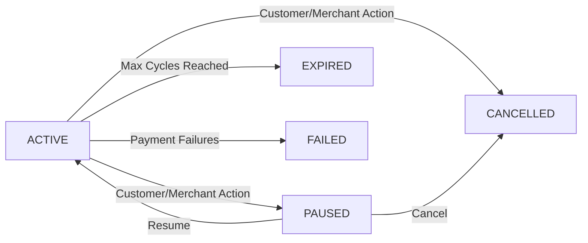

## What is a Subscription Contract?

A subscription contract represents the agreement between a merchant and customer for recurring purchases. It's created when a customer completes a purchase with a selling plan attached.

<Note>
  Each subscription contract is unique to one customer and contains one or more product lines with specific quantities and pricing.
</Note>

## Contract Data Structure

### Basic Contract Details

```typescript
interface SubscriptionContractDetails {
  id: string;
  status: SubscriptionContractStatusType;
  lines: SubscriptionContractDetailsLine[];
  billingPolicy: RecurringPolicy;
  deliveryPolicy: RecurringPolicy;
  nextBillingDate?: string;
  originOrder?: Order | null;
  priceBreakdownEstimate?: PriceBreakdown | null;
  customerPaymentMethod?: CustomerPaymentMethod | null;
  customer?: Customer;
  deliveryMethod?: SubscriptionDeliveryMethod | null;
  billingAttempts: { id: string }[];
  lastPaymentStatus?: 'SUCCEEDED' | 'FAILED' | null;
  lastBillingAttemptErrorType?: string | null;
}
```

### Contract Lines

Each line represents a subscribed product:

```typescript
interface SubscriptionContractDetailsLine {
  id: string;
  title: string;
  variantTitle?: string | null;
  quantity: number;
  productId?: string | null;
  variantId?: string | null;
  currentPrice: Money;
  lineDiscountedPrice: Money;
  variantImage?: {
    altText?: string | null;
    url?: string | null;
  } | null;
  pricingPolicy?: ContractDetailsPricingPolicy | null;
  currentOneTimePurchasePrice?: number;
}
```

<Info>
  The `lineDiscountedPrice` is the total price for that line (price × quantity), after applying any discounts from the pricing policy.
</Info>

### Customer Information

```typescript
interface Customer {
  id: string;
  email?: string | null;
  displayName?: string | null;
  addresses: FormattedAddressWithId[];
}

interface FormattedAddressWithId {
  id: string;
  address: Address;  // Shopify address format
}
```

## Contract Status Lifecycle

### Status Types

```typescript
export const SubscriptionContractStatus = {
  Active: 'ACTIVE',
  Paused: 'PAUSED',
  Cancelled: 'CANCELLED',
  Expired: 'EXPIRED',
  Failed: 'FAILED',
  Stale: 'STALE',
} as const;
```

### Status Transitions



<Accordion title="Status Descriptions">
  - **ACTIVE**: Contract is active and will process billing attempts on schedule
  - **PAUSED**: Temporarily paused, no billing attempts will be made
  - **CANCELLED**: Permanently cancelled, no future billing
  - **EXPIRED**: Reached maximum billing cycles defined in the selling plan
  - **FAILED**: Failed after all dunning retry attempts
  - **STALE**: Data may be out of sync (requires investigation)
</Accordion>

### Terminal Statuses

```typescript
// From DunningService.ts:36
static TERMINAL_STATUS = ['EXPIRED', 'CANCELLED'];
```

When a contract reaches a terminal status, the dunning process automatically stops:

```typescript
private get contractInTerminalStatus(): boolean {
  return DunningService.TERMINAL_STATUS.includes(this.contract.status);
}
```

<Warning>
  Once a contract is in a terminal status (EXPIRED or CANCELLED), it cannot be reactivated. The customer must create a new subscription.
</Warning>

## Pricing and Discounts

### Price Breakdown

```typescript
interface PriceBreakdown {
  totalPrice?: Money;
  subtotalPrice: Money;
  totalTax?: Money;
  totalShippingPrice: Money;
}
```

The price breakdown is calculated from contract lines:

```typescript
function getContractPriceBreakdown({
  currencyCode,
  lines,
  discounts = [],
  deliveryPrice = {amount: 0}
}) {
  const subtotalAmount = lines.reduce(
    (acc, line) => acc + Number(line.lineDiscountedPrice.amount),
    0
  );

  const hasShippingDiscount = discounts.some(
    discount => discount.targetType === 'SHIPPING_LINE'
  );

  return {
    subtotalPrice: { amount: subtotalAmount, currencyCode },
    totalShippingPrice: { 
      amount: hasShippingDiscount ? 0 : deliveryPrice.amount,
      currencyCode 
    }
  };
}
```

### Cycle Discounts

Pricing policies can change over time:

```typescript
interface ContractDetailsPricingPolicy {
  basePrice: Money;
  cycleDiscounts: ContractDetailsCycleDiscount[];
}

interface ContractDetailsCycleDiscount {
  adjustmentType: DiscountTypeType;
  adjustmentValue: CycleDiscountAdjustmentValue;
}
```

**Example**: First 3 months discounted, then regular price
```typescript
{
  basePrice: { amount: 29.99, currencyCode: 'USD' },
  cycleDiscounts: [
    {
      adjustmentType: 'PERCENTAGE',
      adjustmentValue: { percentage: 20 },
      afterCycle: 0  // First cycle
    }
  ]
}
```

## Delivery Methods

Contracts support three delivery method types:

### Shipping Delivery

```typescript
interface ShippingDelivery extends SubscriptionDeliveryMethod {
  shippingOption: { title?: string | null };
  address: CustomerAddress;
}
```

### Local Delivery

```typescript
interface LocalDelivery extends SubscriptionDeliveryMethod {
  localDeliveryOption: {
    title?: string | null;
    phone: string;
  };
  address: CustomerAddress;
}
```

### Local Pickup

```typescript
interface LocalPickup extends SubscriptionDeliveryMethod {
  pickupOption: { title?: string | null };
}
```

The delivery method includes a flag for easy identification:

```typescript
interface SubscriptionDeliveryMethod {
  name: string;          // '__typename' from GraphQL
  isLocalPickup: boolean;
}
```

## Payment Methods

### Supported Payment Instruments

```typescript
interface CustomerPaymentMethod {
  id: string;
  instrument?: PaymentInstrument;
  revokedAt?: string | null;
}

type PaymentInstrument =
  | CustomerCreditCard
  | CustomerShopPayAgreement
  | CustomerPaypalBillingAgreement
  | null;
```

### Credit Card Details

```typescript
interface CustomerCreditCard {
  brand: string;          // 'Visa', 'Mastercard', etc.
  lastDigits: string;     // Last 4 digits
  maskedNumber: string;   // 'XXXX XXXX XXXX 1234'
  expiryYear: number;
  expiryMonth: number;
  expiresSoon: boolean;   // True if expiring within 30 days
  source?: string | null;
}
```

<Warning>
  Always check `revokedAt` before attempting to charge a payment method. A revoked payment method will cause billing failures.
</Warning>

## Contract Operations

### Fetching Contracts

#### List Contracts

```typescript
const {
  subscriptionContracts,
  subscriptionContractPageInfo,
  hasContractsWithInventoryError
} = await getContracts(graphql, {
  first: 25,
  after: cursor
});
```

Returns:

```typescript
interface SubscriptionContractListItem {
  id: string;
  customer: { displayName?: string };
  deliveryPolicy: RecurringPolicy;
  status: SubscriptionContractStatusType;
  totalPrice?: Money;
  lines: SubscriptionContractListItemLine[];
  lineCount: number;
  billingAttempts: BillingAttempt[];
}
```

#### Get Contract Details

```typescript
const contractDetails = await getContractDetails(
  graphql,
  'gid://shopify/SubscriptionContract/123'
);
```

#### Get Contract for Editing

```typescript
const contractEditDetails = await getContractEditDetails(
  graphql,
  'gid://shopify/SubscriptionContract/123'
);
```

<Info>
  The edit details include `currentOneTimePurchasePrice` for each line, allowing you to compare subscription prices with current retail prices.
</Info>

### Finding Contract with Billing Cycle

For dunning operations, you need both contract and billing cycle:

```typescript
const {
  subscriptionContract,
  subscriptionBillingCycle
} = await findSubscriptionContractWithBillingCycle({
  shop: 'example.myshopify.com',
  contractId: 'gid://shopify/SubscriptionContract/123',
  date: '2024-03-15'
});
```

### Get Customer ID

```typescript
const customerId = await getContractCustomerId(
  shopDomain,
  subscriptionContractId
);
```

## Billing Attempts

Billing attempts are recorded on the contract:

```typescript
interface BillingAttempt {
  id: string;
  errorCode?: string | null;
  processingError?: BillingAttemptProcessingError | null;
}

interface BillingAttemptProcessingError {
  code: string;
  insufficientStockProductVariants?: InsufficientStockProductVariant[];
}
```

### Error Types

```typescript
export const BillingAttemptErrorType = {
  InventoryError: 'INVENTORY_ERROR',
  CustomerError: 'CUSTOMER_ERROR',
  Other: 'OTHER',
  PaymentError: 'PAYMENT_ERROR',
} as const;
```

<Note>
  The app handles inventory errors and payment errors differently, with separate retry logic and notification settings for each.
</Note>

## Contract Editing

Contracts can be edited to change:

- Line quantities
- Delivery address
- Delivery frequency
- Payment method
- Line items (add/remove products)

**Example**: Update delivery policy

```typescript
const newDeliveryPolicy = {
  interval: 'WEEK' as SellingPlanInterval,
  intervalCount: 2
};

// Update through SubscriptionContractDraft
await draft.commit({
  deliveryPolicy: newDeliveryPolicy,
  billingPolicy: newDeliveryPolicy
});
```

<Warning>
  Contract edits create a new contract revision. All changes should be validated before committing to avoid creating invalid states.
</Warning>

## Origin Order

Every contract links to its origin order:

```typescript
interface Order {
  id: string;
  name: string;      // Order number like '#1001'
  createdAt: string; // ISO 8601 timestamp
}
```

The origin order contains the initial purchase details and can be referenced for:
- Customer history
- Initial discount codes applied
- Original payment gateway used

## FAQs

<Accordion title="What happens when a contract is paused?">
  When paused, no billing attempts are made and the `nextBillingDate` is cleared. When resumed, a new `nextBillingDate` is calculated based on the current date and the delivery policy.
</Accordion>

<Accordion title="Can I change the selling plan of an existing contract?">
  No, you cannot change the selling plan directly. However, you can modify the delivery/billing policies and pricing policies through contract editing, effectively achieving the same result.
</Accordion>

<Accordion title="How do I handle expired payment methods?">
  Check the `expiresSoon` flag on credit cards. When true, proactively send notifications to customers to update their payment method before the next billing attempt.
</Accordion>

<Accordion title="What's the difference between FAILED and CANCELLED?">
  FAILED means the subscription failed after all dunning retry attempts (automatic). CANCELLED means someone (customer or merchant) explicitly cancelled the subscription (manual action).
</Accordion>

## Related Resources

<CardGroup cols={2}>
  <Card title="Billing Cycles" icon="clock" href="/concepts/billing-cycles">
    Learn how billing cycles process contract charges
  </Card>
  <Card title="Dunning Management" icon="arrows-rotate" href="/concepts/dunning">
    Understand payment failure handling and retries
  </Card>
  <Card title="Managing Contracts" icon="pen-to-square" href="/guides/managing-contracts">
    Step-by-step guide to contract operations
  </Card>
</CardGroup>
