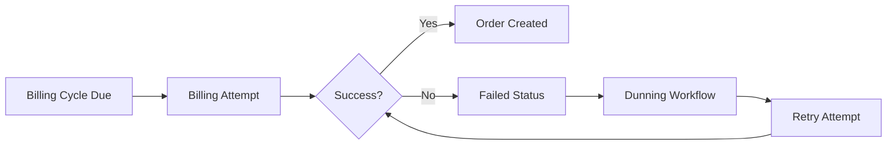

Billing attempts are the payment processing events that occur on each subscription billing cycle. This guide covers monitoring, retrying, and handling failed attempts.

## Overview

A billing attempt:
- Occurs automatically on the billing cycle date
- Creates an order when successful
- Triggers webhooks for success or failure
- Can be manually retried by merchants
- May trigger dunning workflows on failure

## Billing Attempt Lifecycle



## Automatic Billing

Subscriptions are automatically billed using bulk operations:

<Steps>
  <Step title="Schedule bulk billing job">
    A cron job triggers daily to process due billing cycles:

    ```typescript filename="app/jobs/billing/ScheduleShopsToChargeBillingCyclesJob.ts"
    export class ScheduleShopsToChargeBillingCyclesJob extends Job {
      async perform(): Promise<void> {
        // Get all shops with active subscriptions
        const shops = await getAllShopsWithActiveSubscriptions();

        // Enqueue billing job for each shop
        for (const shop of shops) {
          await runner.enqueue(
            new ChargeBillingCyclesJob({
              shop: shop.domain,
              payload: {
                startDate: todayStart,
                endDate: todayEnd,
              },
            }),
          );
        }
      }
    }
    ```
  </Step>

  <Step title="Execute bulk billing mutation">
    The job calls the bulk charge mutation:

    ```typescript filename="app/jobs/billing/ChargeBillingCyclesJob.ts"
    export class ChargeBillingCyclesJob extends Job {
      async perform(): Promise<void> {
        const {shop, payload} = this.parameters;
        const {startDate, endDate} = payload;

        const {admin} = await unauthenticated.admin(shop);

        const response = await admin.graphql(
          ChargeBillingCyclesMutation,
          {
            variables: {
              startDate,
              endDate,
              contractStatus: ['ACTIVE'],
              billingCycleStatus: ['UNBILLED'],
              billingAttemptStatus: 'NO_ATTEMPT',
            },
          },
        );

        const json = await response.json();
        const {job, userErrors} = 
          json.data?.subscriptionBillingCycleBulkCharge;

        if (userErrors.length === 0 && job?.id) {
          this.logger.info(
            `Created subscriptionBillingCycleBulkCharge job: ${job.id}`,
          );
        } else {
          throw new Error('Failed to process ChargeBillingCyclesJob');
        }
      }
    }
    ```
  </Step>

  <Step title="Process webhook events">
    Shopify sends webhooks for success or failure:

    ```typescript filename="app/routes/webhooks.subscription_billing_attempts.failure.tsx"
    export const action = async ({request}: ActionFunctionArgs) => {
      const {topic, shop, payload} = await authenticate.webhook(request);

      logger.info({topic, shop, payload}, 'Received webhook');

      // Start dunning workflow
      jobs.enqueue(
        new DunningStartJob({
          shop,
          payload: payload as Webhooks.SubscriptionBillingAttemptFailure,
        }),
      );

      return new Response();
    };
    ```
  </Step>
</Steps>

## Bulk Billing Mutation

```graphql
mutation ChargeBillingCycles(
  $startDate: DateTime!
  $endDate: DateTime!
  $contractStatus: [SubscriptionContractSubscriptionStatus!]!
  $billingCycleStatus: [SubscriptionBillingCycleBillingCycleStatus!]!
  $billingAttemptStatus: SubscriptionBillingCycleBillingAttemptStatus!
) {
  subscriptionBillingCycleBulkCharge(
    billingCyclesInput: {
      contractStatusFilter: {status: $contractStatus}
      billingCycleStartDateRangeFilter: {
        startDate: $startDate
        endDate: $endDate
      }
      billingCycleStatusFilter: {status: $billingCycleStatus}
      billingAttemptStatusFilter: {status: $billingAttemptStatus}
    }
  ) {
    job {
      id
      done
    }
    userErrors {
      field
      message
    }
  }
}
```

<Note>
  The bulk charge mutation creates a background job. Monitor job completion through the Admin API.
</Note>

## Manual Billing Retry

Merchants can manually retry failed billing attempts:

```graphql
mutation SubscriptionBillingCycleCharge(
  $subscriptionContractId: ID!
  $originTime: DateTime!
) {
  subscriptionBillingCycleCharge(
    subscriptionContractId: $subscriptionContractId
    billingCycleSelector: {date: $originTime}
  ) {
    subscriptionBillingAttempt {
      id
      ready
    }
    userErrors {
      field
      message
      code
    }
  }
}
```

### Retry with Inventory Override

For inventory errors, merchants can create an order with partial fulfillment:

```typescript filename="Create order despite inventory issues"
const handleCreateOrder = async () => {
  // Skip inventory validation and create order anyway
  await billContract(failedBillingCycle.cycleIndex, true);
};
```

## Rebilling Job

Schedule a retry for a specific contract:

```typescript filename="app/jobs/billing/RebillSubscriptionJob.ts"
export class RebillSubscriptionJob extends Job<
  Jobs.Parameters<Jobs.RebillSubscriptionJobPayload>
> {
  public queue: string = 'rebilling';

  async perform(): Promise<void> {
    const {shop, payload} = this.parameters;
    const {subscriptionContractId, originTime} = payload;

    const {admin} = await unauthenticated.admin(shop);

    // Check if already succeeded
    const subscriptionContract = await getContractDetailsForRebilling(
      admin.graphql,
      subscriptionContractId,
    );

    if (subscriptionContract.lastPaymentStatus === 'SUCCEEDED') {
      this.logger.info(
        'Terminating RebillSubscriptionJob, already billed successfully',
      );
      return;
    }

    // Attempt billing
    const response = await admin.graphql(
      SubscriptionBillingCycleChargeMutation,
      {
        variables: {
          subscriptionContractId,
          originTime,
        },
      },
    );

    const json = await response.json();
    const {userErrors} = json.data?.subscriptionBillingCycleCharge;

    // Handle terminal errors
    if (
      userErrors.some(
        (error) =>
          error.code === 'CONTRACT_PAUSED' ||
          error.code === 'BILLING_CYCLE_SKIPPED' ||
          error.code === 'CONTRACT_TERMINATED',
      )
    ) {
      this.logger.warn(
        {subscriptionContractId, userErrors},
        'Persistent userError, terminating RebillSubscriptionJob',
      );
      return;
    }

    if (userErrors.length > 0) {
      throw new Error('Failed to process RebillSubscriptionJob');
    }

    this.logger.info('Successfully called subscriptionBillingCycleCharge');
  }
}
```

<Warning>
  Don't retry indefinitely. Stop retrying for terminal errors like paused/cancelled contracts.
</Warning>

## Dunning Workflow

Dunning handles failed payments with automatic retries:

<Steps>
  <Step title="Start dunning on failure">
    The webhook triggers a dunning start job:

    ```typescript filename="app/jobs/dunning/DunningStartJob.ts"
    export class DunningStartJob extends Job {
      async perform(): Promise<void> {
        const {shop, payload} = this.parameters;
        const {admin_graphql_api_id} = payload;

        // Schedule retry attempts
        const retrySchedule = [
          {delay: 1, unit: 'days'},
          {delay: 3, unit: 'days'},
          {delay: 7, unit: 'days'},
        ];

        for (const retry of retrySchedule) {
          await runner.enqueue(
            new RebillSubscriptionJob({
              shop,
              payload: {
                subscriptionContractId: admin_graphql_api_id,
                originTime: payload.billing_attempt_expected_date,
              },
            }),
            {
              scheduleTime: {
                seconds: DateTime.now()
                  .plus({[retry.unit]: retry.delay})
                  .toUnixInteger(),
              },
            },
          );
        }
      }
    }
    ```
  </Step>

  <Step title="Stop dunning on success">
    When payment succeeds, stop scheduled retries:

    ```typescript filename="app/jobs/dunning/DunningStopJob.ts"
    export class DunningStopJob extends Job {
      async perform(): Promise<void> {
        const {shop, payload} = this.parameters;
        const {admin_graphql_api_id} = payload;

        // Cancel all pending retry jobs for this contract
        await cancelScheduledRetries(shop, admin_graphql_api_id);

        this.logger.info('Dunning stopped for contract');
      }
    }
    ```
  </Step>

  <Step title="Notify customer">
    Send email notifications about payment issues:

    ```typescript
    await runner.enqueue(
      new CustomerSendEmailJob({
        shop,
        payload: {
          contractId: admin_graphql_api_id,
          emailType: 'payment_failed',
        },
      }),
    );
    ```
  </Step>
</Steps>

## Handling Billing Attempt Errors

### Inventory Errors

```typescript
if (errorCode === 'INSUFFICIENT_INVENTORY') {
  // Show banner with product list
  return (
    <FailedBillingAttemptBanner
      onOpen={() => setOpenCreateOrderModal(true)}
      billingCycleDate={failedBillingCycle.billingAttemptExpectedDate}
      productCount={failedBillingCycle.insufficientStockProductVariants.length}
    />
  );
}

if (errorCode === 'INVENTORY_ALLOCATIONS_NOT_FOUND') {
  // Show location configuration error
  return (
    <InventoryAllocationErrorBanner
      billingCycleDate={failedBillingCycle.billingAttemptExpectedDate}
    />
  );
}
```

### Payment Errors

```typescript
if (errorType === 'PAYMENT_ERROR') {
  // Prompt merchant to notify customer
  return (
    <Banner status="critical">
      <p>Payment method was declined. Customer needs to update their payment information.</p>
      <Button onClick={sendPaymentUpdateEmail}>
        Send update request
      </Button>
    </Banner>
  );
}
```

## Polling Billing Attempt Status

After initiating a billing attempt, poll for completion:

```typescript filename="app/routes/app.contracts.$id._index/hooks/usePollBillingAttemptAction.ts"
export function usePollBillingAttemptAction() {
  const fetcher = useFetcher();

  const pollBillingAttempt = useCallback(
    async (cycleIndex: number) => {
      const maxAttempts = 30;
      let attempts = 0;

      while (attempts < maxAttempts) {
        const formData = new FormData();
        formData.append('cycleIndex', String(cycleIndex));

        fetcher.submit(formData, {
          method: 'post',
          action: '/app/contracts/:id/poll-bill-attempt',
        });

        // Wait for response
        await new Promise((resolve) => setTimeout(resolve, 2000));

        if (fetcher.data?.ready) {
          // Billing attempt completed
          return fetcher.data;
        }

        attempts++;
      }

      throw new Error('Billing attempt polling timeout');
    },
    [fetcher],
  );

  return {pollBillingAttempt};
}
```

<Tip>
  Use exponential backoff for polling to reduce API load:
  ```typescript
  const delay = Math.min(1000 * Math.pow(2, attempts), 10000);
  ```
</Tip>

## Webhook Configuration

Ensure billing attempt webhooks are configured:

```toml filename="shopify.app.toml"
[[webhooks.subscriptions]]
topics = [ "subscription_billing_attempts/success" ]
uri = "/webhooks/subscription_billing_attempts/success"

[[webhooks.subscriptions]]
topics = [ "subscription_billing_attempts/failure" ]
uri = "/webhooks/subscription_billing_attempts/failure"
```

## Best Practices

<Steps>
  <Step title="Implement dunning gradually">
    Start with 2-3 retry attempts spaced days apart. Don't overwhelm customers.
  </Step>

  <Step title="Notify customers proactively">
    Send emails when payment fails with clear instructions to update payment method.
  </Step>

  <Step title="Handle inventory gracefully">
    Offer partial fulfillment or product substitution when inventory is low.
  </Step>

  <Step title="Monitor retry success rates">
    Track which retry timing produces the best recovery rates.
  </Step>

  <Step title="Set terminal conditions">
    Stop retrying after a certain number of failures or when contract is cancelled.
  </Step>
</Steps>

## Error Code Reference

| Error Code | Type | Resolution |
|------------|------|------------|
| `INSUFFICIENT_INVENTORY` | Inventory | Restock or create partial order |
| `INVENTORY_ALLOCATIONS_NOT_FOUND` | Inventory | Configure location settings |
| `PAYMENT_METHOD_DECLINED` | Payment | Customer updates payment |
| `PAYMENT_METHOD_INVALID` | Payment | Customer re-adds payment method |
| `CONTRACT_PAUSED` | Terminal | Cannot bill paused contracts |
| `CONTRACT_TERMINATED` | Terminal | Cannot bill cancelled contracts |
| `BILLING_CYCLE_SKIPPED` | Terminal | Customer skipped this cycle |

## Next Steps

<CardGroup cols={2}>
  <Card title="Job Scheduling" icon="clock" href="/guides/job-scheduling">
    Learn about the job runner system for background processing
  </Card>
  <Card title="Setting Up Webhooks" icon="webhook" href="/guides/setting-up-webhooks">
    Configure webhooks to receive billing attempt events
  </Card>
</CardGroup>